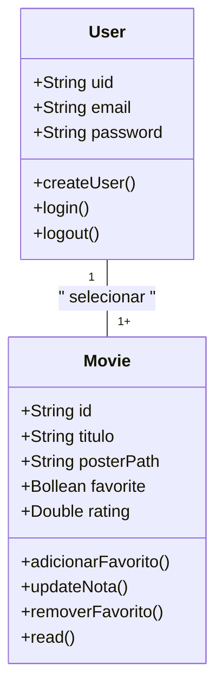

# CineFavorite - Formativa
Construindo um aplicativo do Zero - O CineFavorite permitirá criar uma conta e buscar filmes em uma api e montar uma galeria pessoal de filmes favoritos, com capas e notas.

## Objetivos
- Integrar o Aplicarivo a uma API
- Criar uma conta pessoal no Firebase
- Armazenar informações para cada usuário das preferência solicitadas
- Consultar informações de filmes (capas e títulos)

## Levantamentos de Requisitos
- Funcionais

- Não funcionais

1. ### Diagrama de Classes
    Diagrama que demostra as entidades da aplicação

    - usuário (user) : classe criada pelo firebase
        - email
        - senha
        - id
        - create()
        - login()
        - logout()
    - Filmes (movie) : classe modelada pelo dev
        - id (string)
        - titulo (string)
        - poster (String)
        - favorito (boolean)
        - nota (double)
        - adicionarFavorito()
        - updateNota()
        - removeFavorito()
        - listarFavoritos()

2. ### Diagrama de Uso

3. ### Diagrama de Fluxo

## Prototipagem

- Colocar o Link do Figma

## Codificação